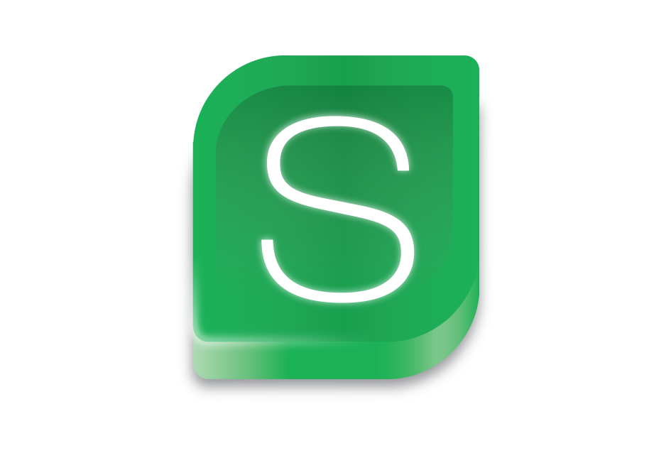

# smpc

[](https://github.com/Norgate-AV/smpc/actions)
[](https://goreportcard.com/report/github.com/Norgate-AV/smpc)
[](https://golang.org)
[](https://github.com/Norgate-AV/smpc/releases)
[](LICENSE)

<div align="center">
  
</div>

A CLI tool to automate compiling [Crestron][crestron] [SIMPL Windows][smpwin] programs.

[crestron]: https://www.crestron.com/
[smpwin]: https://www.crestron.com/Products/Catalog/Control-and-Management/Software/Programming-Commissioning/SW-SIMPL

## Installation

### Using Scoop

```bash
scoop bucket add norgateav-crestron https://github.com/Norgate-AV/scoop-norgateav-crestron.git
scoop install smpc
```

### Using Go Install

```bash
go install github.com/Norgate-AV/smpc@latest
```

### Manual Installation

1. Clone the repository:

    ```bash
    git clone https://github.com/Norgate-AV/smpc.git && cd smpc
    ```

2. Build and install the binary:

    ```bash
    make install
    ```

    This will compile the `smpc` binary and place it in your `$GOBIN` directory.

## Usage

**Note**: This tool requires administrator privileges. See [Administrator Privileges](#administrator-privileges) for details.

Compile a SIMPL Windows program:

```bash
smpc path/to/your/program.smw
```

The tool will:

1. Launch SIMPL Windows with the specified file
2. Automatically trigger compilation
3. Handle any dialog prompts
4. Parse and display compilation results (errors, warnings, notices)
5. Close SIMPL Windows automatically

Exit codes:

- `0`: Compilation successful (warnings/notices are OK)
- `1`: Compilation failed with errors or runtime error

## Configuration

### Custom SIMPL Windows Path

By default, `smpc` looks for SIMPL Windows at:

```text
C:\Program Files (x86)\Crestron\Simpl\smpwin.exe
```

If SIMPL Windows is installed in a different location, set the `SIMPL_WINDOWS_PATH` environment variable:

```powershell
# PowerShell - Current session only
$env:SIMPL_WINDOWS_PATH = "D:\Custom\Path\To\smpwin.exe"

# Or set it permanently (Windows User environment variable)
[System.Environment]::SetEnvironmentVariable('SIMPL_WINDOWS_PATH', 'D:\Custom\Path\To\smpwin.exe', 'User')

# Or add to your PowerShell profile for automatic loading
Add-Content $PROFILE "`n`$env:SIMPL_WINDOWS_PATH = 'D:\Custom\Path\To\smpwin.exe'"
```

```cmd
:: Command Prompt
set SIMPL_WINDOWS_PATH=D:\Custom\Path\To\smpwin.exe

:: Or set it permanently
setx SIMPL_WINDOWS_PATH "D:\Custom\Path\To\smpwin.exe"
```

## Administrator Privileges

This tool requires elevated permissions to:

- Send keystrokes to SIMPL Windows
- Monitor and interact with system dialogs
- Automate the compilation process

### Interactive Use

For the best experience, run `smpc` from an administrator terminal. This allows you to see the
compilation output and logs directly in your terminal.

If you run `smpc` from a non-elevated terminal, it will automatically:

- Check if it's running with administrator privileges
- If not, display a UAC (User Account Control) prompt to request elevation
- Relaunch itself with the required permissions in a new elevated terminal window

You may see a UAC prompt asking "Do you want to allow this app to make changes to your device?" -
click **Yes** to continue.

**Note**: When auto-elevation occurs, the new terminal window will close immediately after
compilation completes. You can view the compilation logs afterward using `smpc --logs`.

### CI/CD Environments

For automated builds in CI/CD pipelines, UAC prompts will block
execution. Additionally, **UI automation requires access to an interactive desktop session**.

#### Critical Requirement: Interactive Desktop Session

GitHub Actions runners (and most CI agents) typically run as Windows services, which execute in
**Session 0** (a non-interactive background session). SIMPL Windows launches in an interactive user
session (Session 1+), and services in Session 0 cannot detect or interact with UI windows in other
sessions due to Windows session isolation.

**This will cause UI automation to fail** - the runner can launch SIMPL Windows, but cannot detect
its window or send keyboard commands.

#### Recommended CI Runner Setup

For UI automation to work, configure a dedicated runner with interactive session access:

1. **Create a dedicated local administrator account** for the CI runner (e.g., `ci-runner`)

2. **Do NOT install the runner as a Windows service**
   - If already installed as a service, remove it first
   - Interactive session access is incompatible with service execution

3. **Configure automatic login** for the runner account on boot

4. **Start the runner using a Windows scheduled task** triggered at user login
   - The task must run with highest privileges in an interactive session
   - Configure the runner to start when the dedicated account logs in

#### UAC Handling

Configure your CI runner to execute with administrator privileges to automatically approve UAC
prompts, or disable UAC on the build machine. Refer to your Windows documentation or system
administrator for the appropriate method for your environment.

#### Alternative: Separate Runner Instances

You can run two runner instances on the same machine:

- **Service runner**: For standard builds/tests (installed as Windows service)
- **Interactive runner**: For UI automation (scheduled task with auto-login)

Use different runner names and labels (e.g., `runs-on: [self-hosted, windows, ui-automation]`) to
route UI automation jobs to the interactive runner.

## LICENSE

[MIT](./LICENSE)
